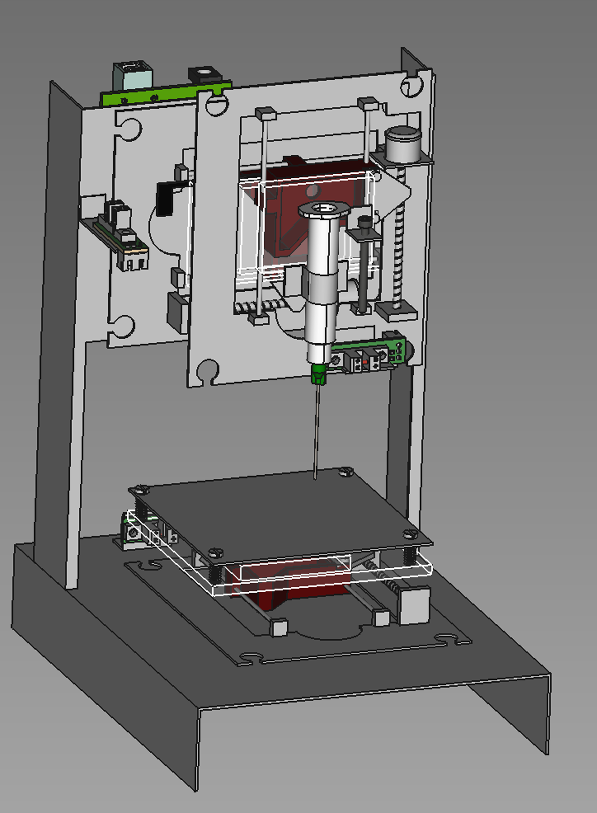

# E-waste bioprinter 
## CellComunicationLab

Repository of the 3D bioprinter Low-Cost using a scrap metal from the Laboratory of Cellular Communication, FIOCRUZ - IOC - Brazil

we describe a low-cost open source bioprinter viable for use in research centers with limited resources worldwide. 

All of our designs, code, bill of materials and instructions can be found here.

 

 
 

 

### Bioprinter mechanical specs

||**Step Resolution (um)**|**Maximum non-printing speed (mm/sec)**|**printing speed range (mm/sec)|Axis range (mm)**|
|--|--|--|--|--|
|**x-axis**|10|80|2 to 10|36|
|**y-axis**|10|80|2 to 10|36|
|**z-axis**|10|40|2 to 10|20|
